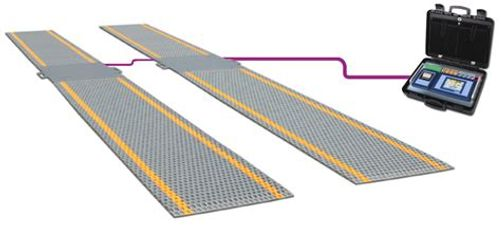
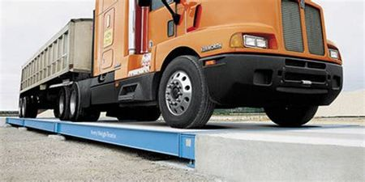

# <b>Welcome to Kenload v2.0.0 User Manual</b>

<h2><b>Introduction</b></h2>

KenLoad Weighing System is a Microsoft Windows/ Linux/ Mac / Solaris based weighing system and has been written to be as user friendly as possible so that anybody can use it, yet comprehensive enough to provide the customer with the system and information he/she needs to run his/her business successfully.

This system is integrated with an IP cameras which takes the picture of the vehicle been weighed. The picture is then saved into a folder. The system also takes weight from Static Axle weigh-bridge, Weighing in Motion, Standard Weighing and Multi deck Weigh bridge.

Once a vehicle has been weighed it is also stored in a data base. When the vehicle comes for weighing, the previous data recorded will automatically appear on the screen. This makes work a lot easier for the operators because they only have to change what needs to be changed, thus saving time.

The KenLoad system can be web based on request therefore can be accessed anywhere by any device provided it is Internet enabled. The data accessible is up to date at any time, therefore on-line users on the web can access the currently weighed vehicle with its picture.

### [About](about.md)

### [Abbreviations](abbreviations.md)
